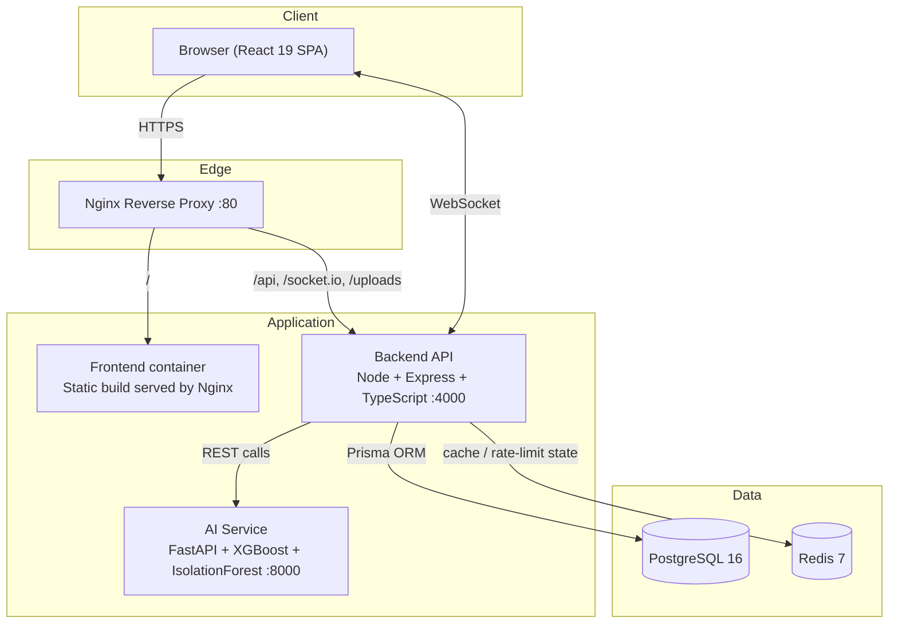

# Architecture

## System Overview

## Request flow: placing a sales order

1. React app calls `POST /api/orders` with items and customer info.
2. Express validates the JWT (RBAC: ADMIN, WAREHOUSE_MANAGER, SALES_EXECUTIVE only), then Zod-validates the payload.
3. `order.controller.ts` computes totals from live product prices, creates the `Order` + `OrderItem` rows in a single Prisma call.
4. For each line item, `inventory.service.ts::adjustStock` runs inside a DB transaction: it locks/updates the `Inventory` row, writes an `InventoryLog` entry, and re-reads the product's `reorderPoint`.
5. If the new quantity is at or below the reorder point, a `inventory:low-stock` Socket.io event is broadcast to all connected clients — the frontend shows a toast in real time.
6. The response returns the created order; the frontend can then call `POST /orders/:id/invoice` to generate a PDF invoice (PDFKit) saved under `/uploads/invoices` and served statically.

## AI feature flow: demand forecast

1. Backend gathers the product's `STOCK_OUT` history from `InventoryLog`.
2. It POSTs `{ history, horizonDays: 30 }` to the AI service's `/forecast/demand`.
3. The AI service engineers lag/rolling features (`app/features.py`) and either:
   - runs the trained XGBoost model iteratively (predicting one day, feeding it back as a lag feature for the next), or
   - falls back to a seasonal moving-average if there isn't enough history or no model file exists yet.
4. Predictions (date, value, confidence) are returned to the backend, which upserts them into the `Forecast` table and returns them to the frontend for charting.

## Why a separate AI microservice?

- **Language fit**: scikit-learn / XGBoost / Prophet are Python-native; keeping them out of the Node process avoids FFI/bindings pain.
- **Independent scaling**: the AI service can be scaled or GPU-accelerated separately from the request-serving API.
- **Fault isolation**: if model inference is slow or errors, it degrades gracefully (see fallback logic) instead of taking down order/inventory APIs.

## Real-time layer

Socket.io runs on the same HTTP server as the Express API (not a separate port), authenticated via the same JWT access token passed in the connection handshake. Each user joins a `user:{id}` room for targeted notifications, plus the global namespace for broadcast events (inventory updates, transfer status, presence).

## Data model

See [ER_DIAGRAM.md](./ER_DIAGRAM.md) for the full entity-relationship diagram.
