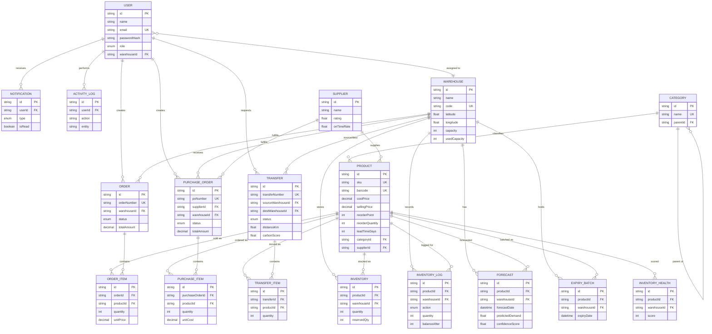

# Entity-Relationship Diagram

Rendered from `backend/prisma/schema.prisma`. Paste into [mermaid.live](https://mermaid.live) to view interactively, or view directly in any Markdown renderer that supports Mermaid (GitHub does this natively).

## Notes on design choices

- **Soft deletes** (`deletedAt`) on Users, Warehouses, Categories, Suppliers, Products, Orders, PurchaseOrders, and Transfers so records can be restored (Recycle Bin) rather than destroyed.
- **`Inventory` is per (product, warehouse) pair** — a unique composite index on `(productId, warehouseId)` means stock levels are always looked up/updated atomically per location, which is what makes multi-warehouse sync correct.
- **`InventoryLog` is append-only** and is the audit trail every stock-level number is derived from; `Inventory.quantity` is a materialized/cached current total for fast reads.
- **`AuditLog` vs `ActivityLog`**: `ActivityLog` is a lightweight "who did what" feed for the UI's activity timeline; `AuditLog` stores before/after JSON snapshots for compliance-grade change tracking.
